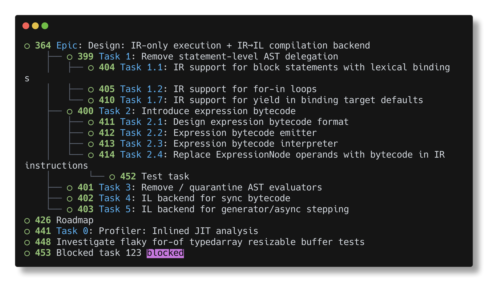
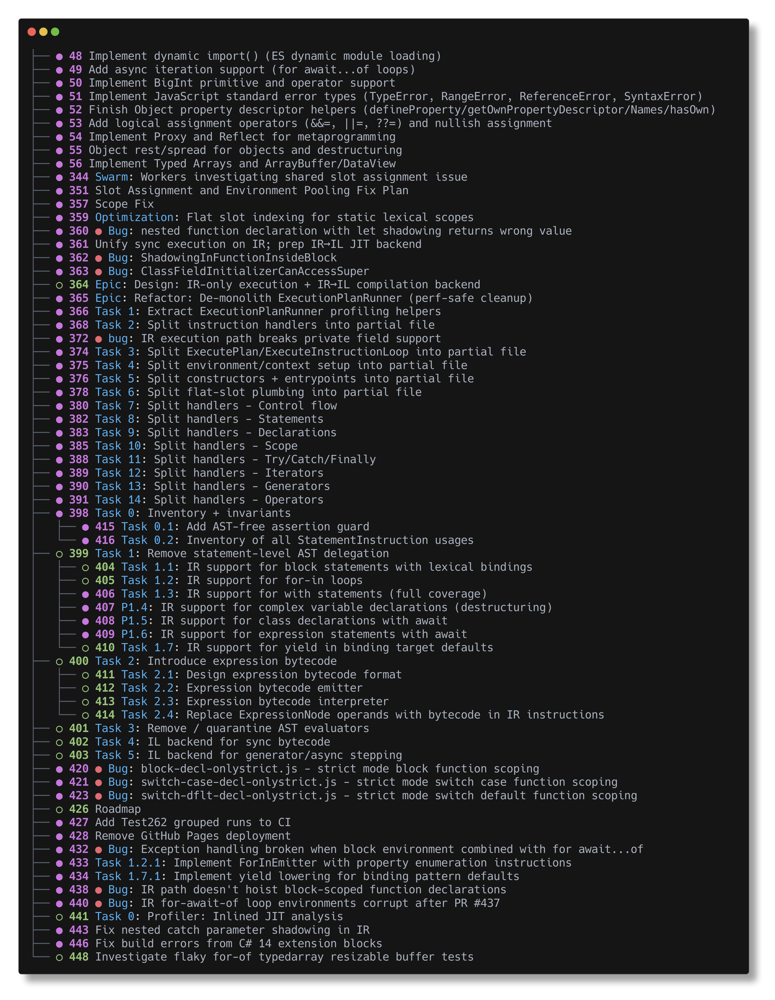
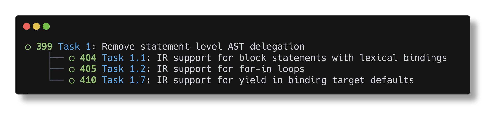

# Asynkron.GitHubCliX

A thin wrapper around GitHub CLI (`gh`) with extra visualizations.

Features
- Pass-through to `gh` for all commands
- `ghx issue tree` renders parent-child issue trees
- Flags: `--open`, `--closed`, `--root <title|#id|id>`
- Styled output using charmbracelet/lipgloss

Install
- From source: `go install ./cmd/ghx`

Usage
- `ghx issue tree`
- `ghx issue tree --open --closed`
- `ghx issue tree --root "Task 1"`
- `ghx issue tree --root 399`

Notes
- Parent relationship parsed from issue body line: `Parent: #<number>`

Updated: 2026-01-07T10:53:41.763Z

## Screenshots (2026-01-07T11:22:45.219Z)

Command: ghx issue tree

Command: ghx issue tree --open --closed

Command: ghx issue tree -root 399

Command: ghx issue tree -root "AST delegation"

